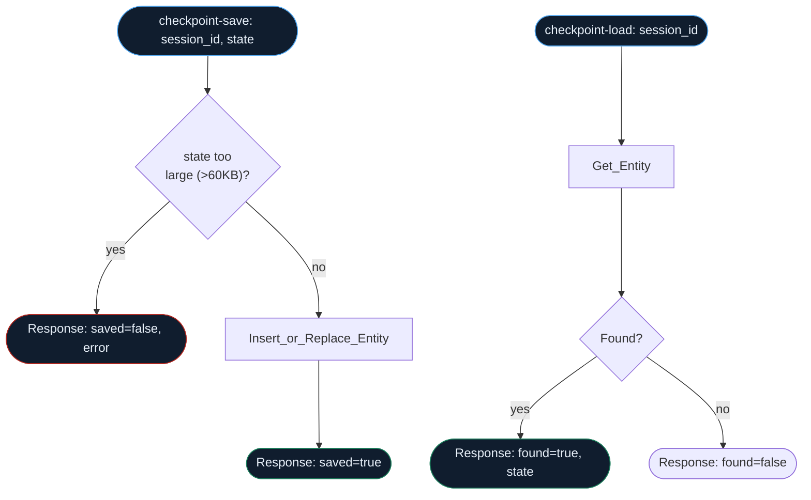

## How checkpoint-save / checkpoint-load actually flow



--8<-- "artifacts/logicapps/checkpoint-resume/README.md"

## `checkpoint-save` workflow JSON

```json
--8<-- "artifacts/logicapps/checkpoint-resume/checkpoint-save.trigger-and-response.json"
```

## `checkpoint-load` workflow JSON

```json
--8<-- "artifacts/logicapps/checkpoint-resume/checkpoint-load.trigger-and-response.json"
```

## `verified.yml`

```yaml
--8<-- "artifacts/logicapps/checkpoint-resume/verified.yml"
```

## Broken variant

--8<-- "artifacts/logicapps/checkpoint-resume/broken/README.md"

```json
--8<-- "artifacts/logicapps/checkpoint-resume/broken/checkpoint-save.no-size-guard.json"
```
