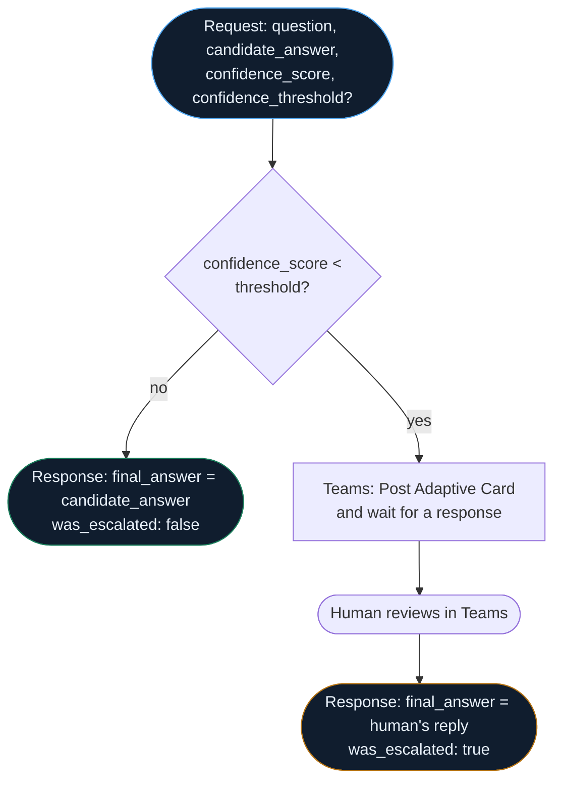

## How `confidence-gated-escalation` actually flows



--8<-- "artifacts/logicapps/confidence-gated-escalation/README.md"

## `confidence-gated-escalation` workflow JSON

```json
--8<-- "artifacts/logicapps/confidence-gated-escalation/confidence-gated-escalation.trigger-and-response.json"
```

## `verified.yml`

```yaml
--8<-- "artifacts/logicapps/confidence-gated-escalation/verified.yml"
```

## Broken variant

--8<-- "artifacts/logicapps/confidence-gated-escalation/broken/README.md"
