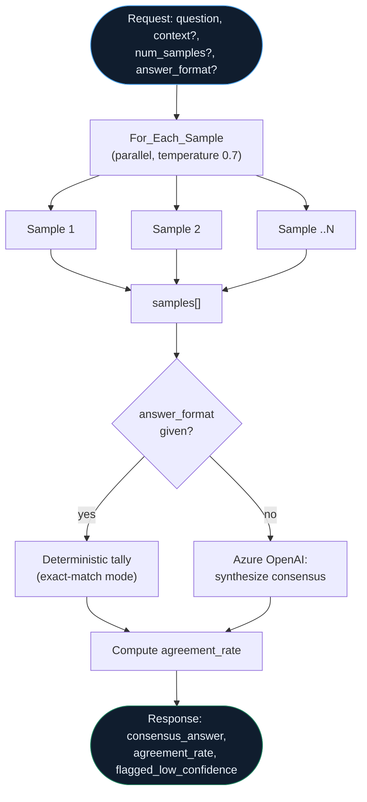

## How `debate-consensus` actually flows



--8<-- "artifacts/logicapps/debate-consensus/README.md"

## `debate-consensus` workflow JSON

```json
--8<-- "artifacts/logicapps/debate-consensus/debate-consensus.trigger-and-response.json"
```

## `verified.yml`

```yaml
--8<-- "artifacts/logicapps/debate-consensus/verified.yml"
```

## Broken variant

--8<-- "artifacts/logicapps/debate-consensus/broken/README.md"
