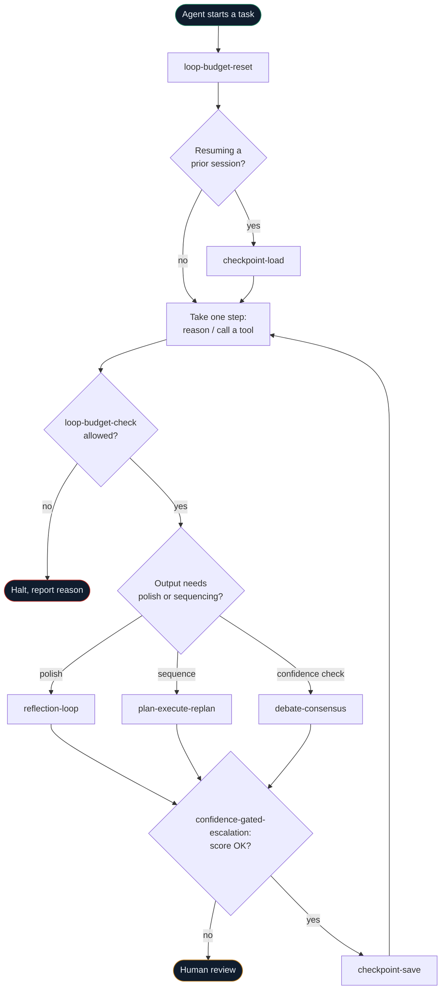

# Agent loop harnesses

Tools that wrap the *loop itself*, not a downstream system — budgets, self-checks, and crash recovery for a running agent, none of which Azure's own tooling provides today. See [the gap analysis](../logic-apps-mcp/mcp-gap-analysis.md#1-composite-tools-orchestration-the-wizard-cant-do) for why.

## How these six fit together

Every box above is a separate, independently deployable MCP tool — none of them require the others, but they're designed to compose exactly like this.

## The six tools

| Tool | What it stops or enables | Status |
|---|---|---|
| [Loop circuit breaker](loop-circuit-breaker.md) | Hard stop on step/cost budget before a loop runs away | preview |
| [Reflection / self-critique loop](reflection-loop.md) | Plan→execute→critique→revise, capped iterations, deterministic check alongside the LLM judge | preview |
| [Plan-execute-replan loop](plan-execute-replan.md) | Decomposes a task, executes sub-steps, replans on failure | preview |
| [Multi-agent debate / self-consistency](debate-consensus.md) | N parallel sampled calls, consensus vote, confidence spread | preview |
| [Confidence-gated human escalation](confidence-gated-escalation.md) | Hands off to a human via Teams with full context when confidence is low | preview |
| [Checkpoint/resume for long-running loops](checkpoint-resume.md) | A crashed agent session resumes instead of restarting | preview |

Each page above has the full use case, portal steps, worked example, and the complete workflow JSON inline — no need to leave the site.

!!! warning "Before you build the reflection loop"
    A 2026 RAND study found no LLM-as-judge setup is uniformly reliable — frontier models exceeded 50% error rates on hard bias benchmarks. Every harness here that uses a model to check another model's work pairs it with a hard iteration cap and a deterministic secondary check — never a bare "ask the model if this is good" loop with no ceiling.
