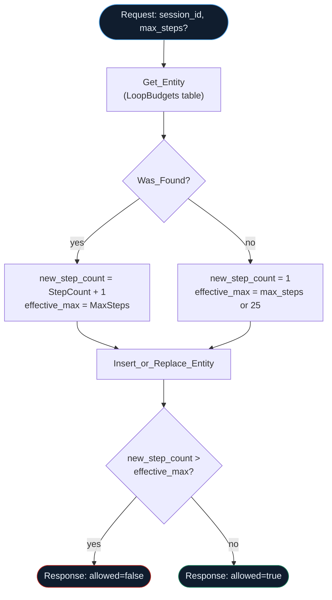

## How `loop-budget-check` actually flows



`loop-budget-reset` is the same Table Storage write with no lookup — it always writes `StepCount: 0`.

--8<-- "artifacts/logicapps/loop-circuit-breaker/README.md"

## `loop-budget-check` workflow JSON

```json
--8<-- "artifacts/logicapps/loop-circuit-breaker/loop-budget-check.trigger-and-response.json"
```

## `loop-budget-reset` workflow JSON

```json
--8<-- "artifacts/logicapps/loop-circuit-breaker/loop-budget-reset.trigger-and-response.json"
```

## `verified.yml`

```yaml
--8<-- "artifacts/logicapps/loop-circuit-breaker/verified.yml"
```

## Broken variant

--8<-- "artifacts/logicapps/loop-circuit-breaker/broken/README.md"

```json
--8<-- "artifacts/logicapps/loop-circuit-breaker/broken/loop-budget-check.vague-description.json"
```
