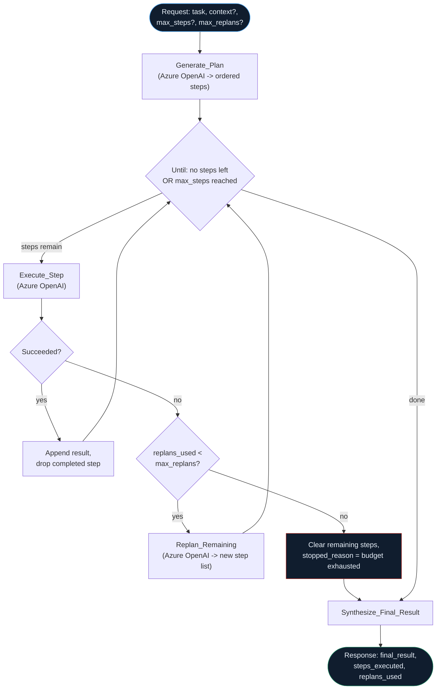

## How `plan-execute-replan` actually flows



--8<-- "artifacts/logicapps/plan-execute-replan/README.md"

## `plan-execute-replan` workflow JSON

```json
--8<-- "artifacts/logicapps/plan-execute-replan/plan-execute-replan.trigger-and-response.json"
```

## `verified.yml`

```yaml
--8<-- "artifacts/logicapps/plan-execute-replan/verified.yml"
```

## Broken variant

--8<-- "artifacts/logicapps/plan-execute-replan/broken/README.md"
