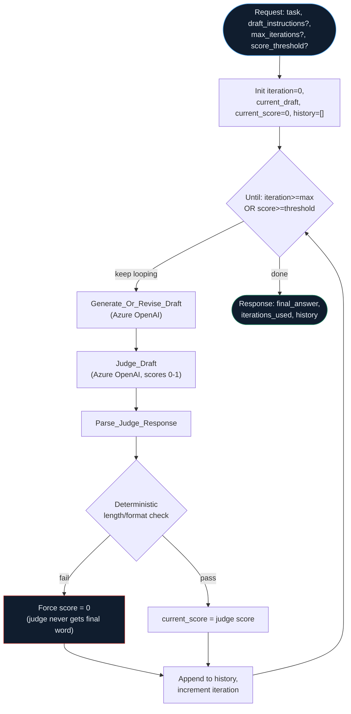

## How `reflection-loop` actually flows



--8<-- "artifacts/logicapps/reflection-loop/README.md"

## `reflection-loop` workflow JSON

```json
--8<-- "artifacts/logicapps/reflection-loop/reflection-loop.trigger-and-response.json"
```

## `verified.yml`

```yaml
--8<-- "artifacts/logicapps/reflection-loop/verified.yml"
```

## Broken variant

--8<-- "artifacts/logicapps/reflection-loop/broken/README.md"

```json
--8<-- "artifacts/logicapps/reflection-loop/broken/reflection-loop.judge-only.json"
```
