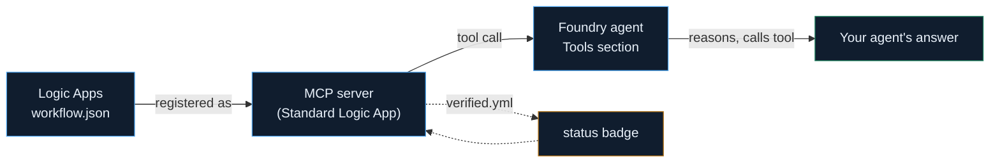

# Azure Agentic Toolshed

Working Azure agent plumbing, with receipts.

Deployable, not descriptive
Failure-first docs
Machine-checked staleness
100% open source

Most Azure agent docs describe what a feature does. This is a library of **deployable** Logic Apps workflows exposed as MCP tools for AI agents — real `workflow.json` you paste in, exact portal steps, a worked example, and a `verified.yml` that says whether it's actually been tested.

:fontawesome-solid-sack-dollar: **On cost** — everything here is free and open source. The only paid resource anywhere in this project is the Azure subscription used to deploy and test artifacts. See each artifact's own cost note before building it.

## How a tool here actually gets used

## Start here

-   :material-help-circle: **Help — how to read a tool page**

    ---

    New here? This explains what every section on a tool page means, in one short table.

    [:octicons-arrow-right-24: Read it](help/index.md)

-   :material-map-search: **The gap analysis**

    ---

    What's actually missing from Azure's own MCP tooling — and why every artifact here is scoped the way it is.

    [:octicons-arrow-right-24: Read it](logic-apps-mcp/mcp-gap-analysis.md)

-   :material-book-open-variant: **Conventions**

    ---

    The rules every tool follows: one workflow = one tool, write descriptions for a model, code-first over designer-clicking.

    [:octicons-arrow-right-24: Read it](logic-apps-mcp/conventions.md)

-   :material-bug: **Failures, by error text**

    ---

    Searched an exact error string to get here? This is the section for you.

    [:octicons-arrow-right-24: Read it](failures/index.md)

-   :material-school: **Learning path**

    ---

    The Azure, AI, and DevOps concepts this project is structured to teach as you build it.

    [:octicons-arrow-right-24: Read it](learning/index.md)

## The tool catalog

Organized by what a tool is *for*, not which Azure service backs it:

-   :material-repeat-variant: **[Agent loop](agent-loop/index.md)**

    Harnesses for reflection, planning, budget enforcement, and human escalation inside a running agent loop.

-   :material-graph-outline: **[Orchestration](orchestration/index.md)**

    Multi-agent coordination — memory, routing, task queues, interop with A2A.

-   :material-tools: **[Foundry tools](foundry-tools/index.md)**

    Guardrails, RAG helpers, and AI-service-backed tools you attach directly to a Foundry agent.

-   :material-pipe-wrench: **[Plumbing](plumbing/index.md)**

    Connector-backed business tools (Teams, SharePoint, GitHub, Jira, Excel) and small high-hit-rate utilities.

-   :material-swap-horizontal: **[Cross-host compatibility](cross-host/index.md)**

    Which transport (SSE vs. streamable-HTTP) actually works with which agent client.

-   :material-database-sync: **[Concordance](concordance/index.md)**

    Naming changes, retirements, and SDK renames across Azure's AI stack, as versioned data.

## Status, at a glance

verified tested, working
&nbsp;&nbsp;
preview built, not yet tested
&nbsp;&nbsp;
broken-upstream platform bug
&nbsp;&nbsp;
stale source drifted

`stale` flips automatically — a bot rechecks every artifact's cited Microsoft Learn source weekly.
